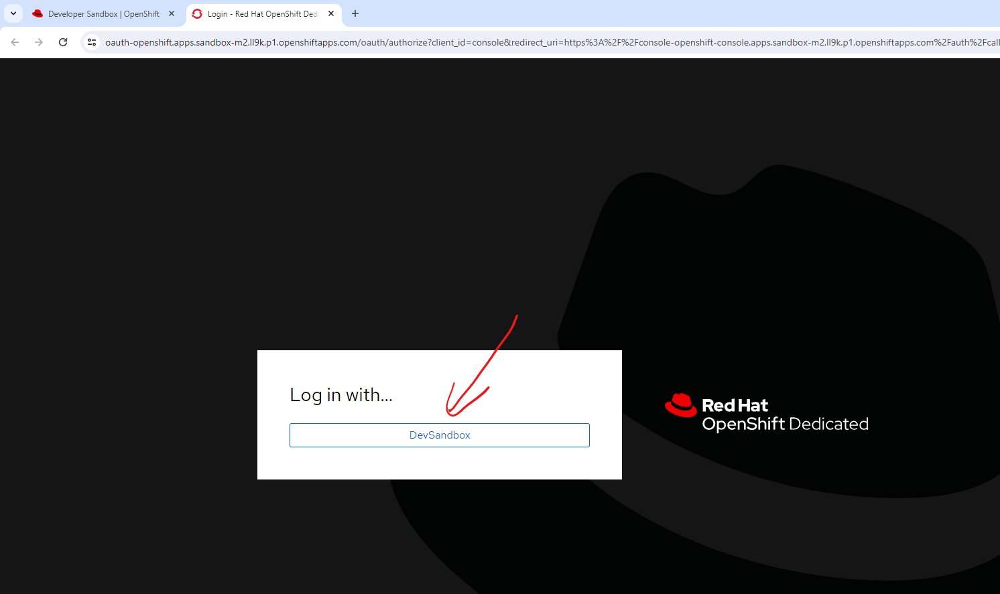

# kto-mlflow-install-2023

## Procédure d'installation simplifiée

Connectez-vous à votre Sandbox Openshift Red Hat. Suivez ce [lien](https://console.redhat.com/openshift/sandbox).

Il vous est demandé de vous identifier, faites le : 


Puis, lancez votre Sandbox, il est possible qu'un formulaire d'information vous soit proposé :





Sélectionnez votre projet : 


Maintenant, ouvrez votre Web Terminal, attention, il existe à date un bug avec composant. Voici la procédure à suivre.
Cliquez sur le bouton suivant : 


Vérifiez que par défaut, votre projet soit bien sélectionné et cliquez sur Start : 


Patientez quelques instants, un prompt vous sera proposé : 


Maintenant que votre web terminal est démarré, veuillez jouer les commandes suivantes (vous pouvez tout copier/coller
, il est possible que le collage ne fonctionne qu'avec un clic droit => Coller):
```bash
git clone https://github.com/guillaume-thomas/kto-mlflow-install-2023
cd kto-mlflow-install-2023
chmod 777 install.sh
./install.sh

```


Le terminal vous demandera le nom de votre compte openshift, saisissez-le sans faire d'erreur **ET SANS ESPACE ET SANS LE -DEV** :
# J'insiste, sans le -dev


Tapez sur Entrée.
Le terminal vous demandera ensuite le nom de votre cluster, saisissez-le également sans faire d'erreur **ET DE NOUVEAU, SANS ESPACE**.
Vous pouvez faire un copié collé. Prenez bien la suite de lettres et chiffres entre `apps.` et `.openshiftapps` (...apps.**m2.ll9k.p1**.openshiftapps.com/). 


Puis tapez sur Entrée. Patientez jusqu'à la fin de la procédure (5 minutes maximum). C'est terminé !

Pour valider que cela fonctionne, constatez que `End of installation` s'affiche dans votre terminal, puis cliquez sur `Administrator`
dans la liste déroulante en haut à gauche, puis sur `Networking` puis sur `Routes`. Identifiez la ligne `minio-console` et cliquez sur le lien :


Attention, sur Chrome notamment, il est possible que l'ouverture de la page échoue. Vérifiez que l'url ne soit pas en `https`.
Si c'est le cas, retirez le `s`.


Vous arrivez sur cette page d'authent. Le login est `minio` et le mot de passe `minio123`. Connectez-vous :


Constatez que vous avez bien ceci : 


Je vous prie de me faire parvenir une capture de cet écran par mail. Bravo et merci à vous !

